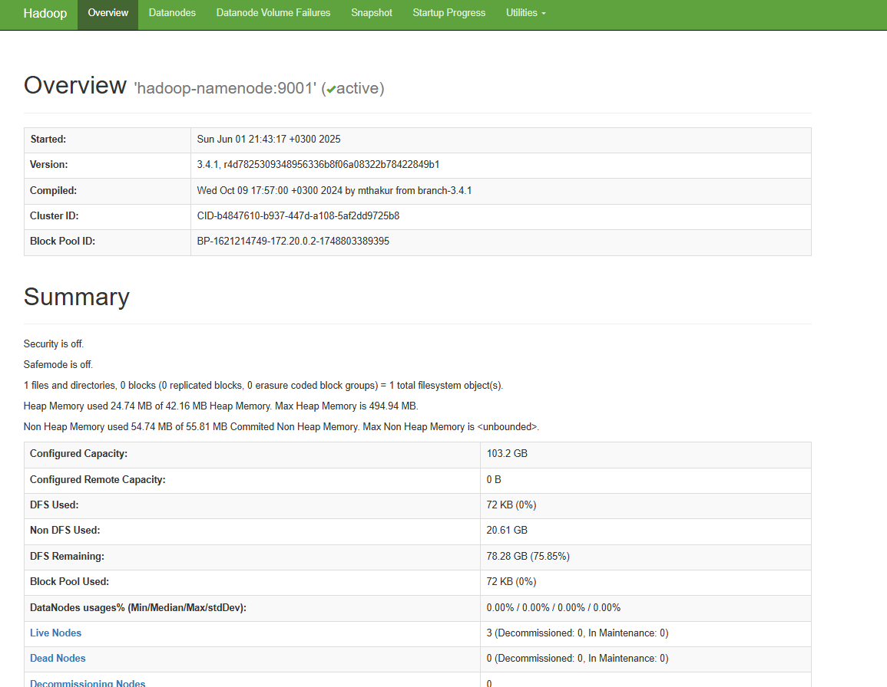
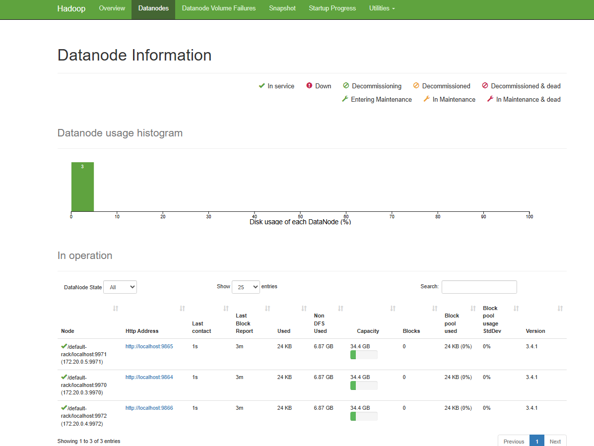

# Подготовка

* `docker compose up -d`
* Спроксируем порт с хоста на локальный компьютер `ssh -L 9870:localhost:9870 user@51.250.68.3`
* Увидим по дашбордам, что кластер hadoop успешно запустился

